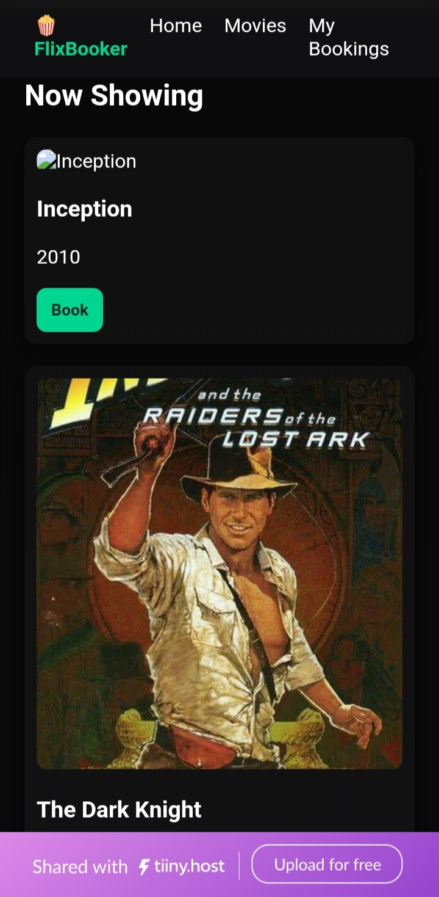

# 🎬 FlixBooker

FlixBooker is a modern movie booking website designed to provide users with a smooth and interactive cinema ticket booking experience.

🌐 Live Website: https://flixbooker.tiiny.site/

---

## Features

- 🎥 Browse available movies
- 📅 View movie schedules
- 🎟️ Book tickets online
- 📍 Select theatre and seats
- 📱 Responsive design for mobile and desktop
- ⚡ Fast and user-friendly interface

---
## Preview of screenshot 

### Homepage


### Homepage 1


---

##  Tech Stack

Frontend:
- HTML5
- CSS3
- JavaScript

## Project Structure

```
flixbooker/
│
├── index.html
├── style.css
├── script.js
├──  images/
└── README.md
```

---

##  Installation

Clone the repository:

```bash
git clone https://github.com/adrijadas349-cmd/flixbooker.git
```

Move into the project:

```bash
cd flixbooker
```

Open:

```bash
index.html
```

---

##  Future Improvements

- User authentication
- Payment gateway integration
- Booking history
- Movie recommendation system
- Dark mode
- Backend database support

---

## Contributing

Contributions are welcome.

1. Fork the repository
2. Create a new branch
3. Commit changes
4. Open a Pull Request

---

##  License

This project is for educational and portfolio purposes.

---

## Author

Created by **Adrija Das**

GitHub: https://github.com/adrijadas349-cmd
